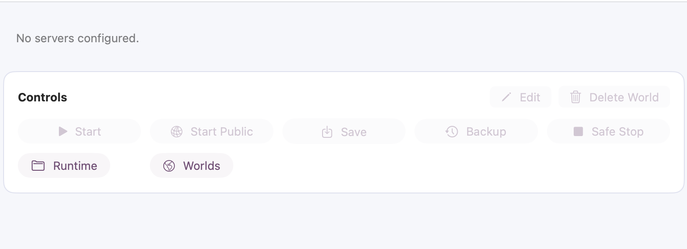

<div align="center">
  

  # Terrager

  Native macOS hosting manager for Terraria dedicated server worlds.

  [](https://github.com/ApocalixDeLuque/Terrager/releases/latest)
  [](https://github.com/ApocalixDeLuque/Terrager/actions/workflows/release.yml)
  [](LICENSE)
  [](https://www.apple.com/macos/)
  [](Sources/Terrager/Terrager.swift)
  [](https://terraria.org/)

  <br>

  
</div>

## What It Does

Terrager gives Mac users a focused interface for hosting Terraria worlds without keeping terminal commands in their head. It manages profiles, launches the Terraria dedicated server, saves worlds, creates backups, restores backups, and shows join information for local network play.

## Highlights

| Area | Detail |
| --- | --- |
| Profiles | Reusable server profiles with world, port, player count, difficulty, seed, and executable path. |
| Runtime | Starts Terraria servers in detached `screen` sessions. |
| World safety | Save, backup, safe-stop, restore, import, and delete flows are state-aware. |
| Backups | Manual backups plus scheduled snapshots only while matching servers are running. |
| Networking | Shows same-Wi-Fi join details and optional user-configured public endpoint info. |
| Open source hygiene | No bundled worlds, credentials, tunnel config, IP addresses, hostnames, or machine-specific paths. |

## Requirements

| Requirement | Notes |
| --- | --- |
| macOS | macOS 13 or newer. |
| Terraria server | Terraria from Steam or a compatible `TerrariaServer` binary selected in the app. |
| `screen` | Included with macOS. |

> [!IMPORTANT]
> Terrager does not bundle Terraria, Terraria server binaries, worlds, private configs, public tunnel credentials, or network addresses.

## Install

1. Download the latest `Terrager.dmg` from [Releases](https://github.com/ApocalixDeLuque/Terrager/releases/latest).
2. Open the DMG.
3. Move `Terrager.app` into Applications.
4. Open Terrager.

> [!NOTE]
> The public build is ad-hoc signed. If macOS Gatekeeper blocks the first launch, open it from Finder with right click -> Open.

## Runtime Data

Terrager stores user-generated data outside the repository:

```text
~/Library/Application Support/Terrager/
  config/
  logs/
  scripts/
  serverconfigs/
  worlds/
  worlds/backups/
```

This keeps the source tree clean and makes it safe to publish the repository.

## Public Access

Terrager can display public join information, but it does not configure or bundle a tunnel provider. If you use a tunnel or port-forwarding setup, create:

```text
~/Library/Application Support/Terrager/config/public-endpoint.env
```

```env
PUBLIC_HOST=play.example.net
PUBLIC_PORT=7777
PUBLIC_LOCAL_PORT=7777
```

`PUBLIC_LOCAL_PORT` is optional. If omitted, the endpoint is shown for any selected profile.

## Build

```sh
scripts/build.sh
```

Outputs:

| Artifact | Purpose |
| --- | --- |
| `dist/Terrager.app` | macOS app bundle. |
| `dist/Terrager.dmg` | User-facing disk image. |

Run validation:

```sh
scripts/check.sh
```

## Documentation

| Document | Purpose |
| --- | --- |
| [Architecture](docs/ARCHITECTURE.md) | App model, runtime layout, and process model. |
| [Configuration](docs/CONFIGURATION.md) | Profiles, backups, endpoints, and LaunchAgents. |
| [Building](docs/BUILDING.md) | Local builds, validation, releases, signing, and notarization. |
| [Contributing](CONTRIBUTING.md) | Development rules and PR checklist. |
| [Security](SECURITY.md) | Sensitive-data boundaries and reporting. |

## License

MIT. See [LICENSE](LICENSE).
